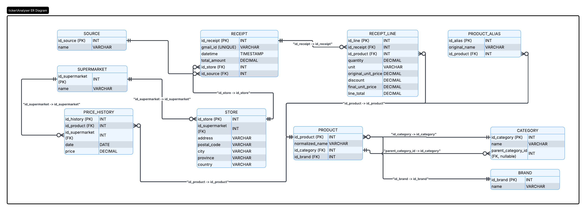

<div align="center">

# 🧾 Ticket Analyzer

**Turn the supermarket receipts that land in your Gmail into clean, structured, queryable data.**

AI-powered OCR · Product & brand normalization · Self-improving few-shot learning · Derived price history · SQLAlchemy ORM

[](https://www.python.org/)
[](https://www.sqlalchemy.org/)
[](https://alembic.sqlalchemy.org/)
[](https://ai.google.dev/)
[](https://developers.google.com/gmail/api)
[](https://docs.pytest.org/)
[](#-license)

</div>

---

## 📑 Table of Contents

- [Overview](#-overview)
- [Key Features](#-key-features)
- [System Architecture](#-system-architecture)
- [End-to-End Flow](#-end-to-end-flow)
- [Data Model](#-data-model)
- [Module Reference](#-module-reference)
- [The Self-Improving OCR Loop](#-the-self-improving-ocr-loop)
- [Category Taxonomy](#-category-taxonomy)
- [Tech Stack](#-tech-stack)
- [Requirements](#-requirements)
- [Installation](#-installation)
- [Configuration](#-configuration-env)
- [Usage](#-usage)
- [Database Migrations](#-database-migrations)
- [Reviewing Learned Aliases](#-reviewing-learned-aliases)
- [Testing](#-testing)
- [Project Structure](#-project-structure)
- [Design Decisions](#-design-decisions)
- [Roadmap](#-roadmap)
- [Troubleshooting](#-troubleshooting)
- [License](#-license)

---

## 🔍 Overview

**Ticket Analyzer** is an automated ETL pipeline that transforms Spanish supermarket receipts (*tickets*) — the ones that arrive as email attachments — into a clean relational dataset ready for spending analytics and price comparison.

The pipeline covers the full lifecycle of a receipt: it reads the email, downloads the attached PDF/image, extracts every product line with an AI-powered OCR model, **normalizes** the data (product names, brands, categories), and persists everything into a PostgreSQL (or SQLite) database — all idempotently, so re-running the pipeline never creates duplicates.

The system is built and tested primarily against **Mercadona, Lidl, and Dia** (the project is based in Zaragoza, Spain), but the OCR prompt and schema are designed to generalize to any Spanish chain, and gracefully handle unknown supermarkets.

What sets it apart from a plain OCR wrapper:

- It **separates the brand** (manufacturer or private label) from the raw product name.
- It **completes truncated/abbreviated names** (`PLT TOM 1KG` → `Tomate pera`).
- It maps every product to **exactly one** category from a curated 24-category taxonomy.
- It keeps every raw receipt name as an **alias**, and feeds curated aliases back into the model as few-shot examples — so accuracy improves as the dataset grows.

---

## ✨ Key Features

| | |
|---|---|
| 🧠 **Robust AI-powered OCR** | Gemini 2.5 Flash reads receipts with complex layouts, abbreviations, and truncated names, constrained to strict JSON output. |
| 🏷️ **Brand recognition** | Detects manufacturer brands and, when none is printed, infers the supermarket's private label (Mercadona → Hacendado/Deliplus/Bosque Verde, Lidl → Milbona/Cien, Alcampo → Auchan…). |
| 🧩 **Product normalization** | Expands abbreviations and separates brand, category, and alias from the original ticket string. |
| 🔁 **Self-improving few-shot loop** | Learned aliases are merged into the OCR prompt as examples, curated via an interactive CLI. |
| 📍 **Structured addresses** | Extracts address, postal code, city, and derives the province from the Spanish postal-code prefix. |
| 💸 **Discount & weight handling** | Correctly absorbs loyalty discounts (`PROMO LIDL PLUS`, `Club Carrefour`…) and handles weight-variable products (€/kg). |
| 📊 **Derived price history** | Price evolution per product/supermarket is a query — derivable from `receipt_line ⋈ receipt ⋈ store ⋈ supermarket` — no redundant table. |
| 🛡️ **Strict validation** | Rejects receipts with missing required fields before touching the database. |
| ↩️ **Atomic transactions** | One receipt = one transaction. Any error rolls the whole receipt back; partial receipts never reach the DB. |
| 🧱 **Race-condition safety** | `get_or_create_*` on unique-constrained entities uses SAVEPOINTs to survive concurrent inserts (TOCTOU). |
| 🚫 **Idempotency** | Unique `gmail_id` + `receipt_exists()` guard prevent reprocessing and duplicate Gemini calls. |
| 🪵 **Comprehensive logging** | Console + rotating file (`logs/app.log`), level configurable via `LOG_LEVEL`. |
| 🐘 **PostgreSQL or SQLite** | Production-ready on PostgreSQL; zero-config SQLite fallback for development and tests. |
| 🔀 **Alembic migrations** | Versioned schema evolution that works on both PostgreSQL and SQLite (batch mode). |

---

## 🏗️ System Architecture

```
┌──────────────┐   ┌────────────────┐   ┌──────────────────┐   ┌────────────────────┐
│  Gmail API   │──▶│  OCR (Gemini)  │──▶│  JSON Validation │──▶│  Insert Layer (ORM) │
│  src/gmail/  │   │  src/ocr/      │   │  src/etl/        │   │  src/db/insert.py    │
└──────────────┘   └───────┬────────┘   └──────────────────┘   └─────────┬──────────┘
                           │                                             │
                    ┌──────▼───────┐                            ┌────────▼─────────┐
                    │ few-shot     │                            │  PostgreSQL /    │
                    │ examples     │◀── learned aliases ────────│  SQLite          │
                    │ src/ocr/     │                            └──────────────────┘
                    │ examples.py  │
                    └──────────────┘
```

The pipeline is split into four cooperating packages under `src/`, plus a review script and an Alembic migration environment:

1. **`src/gmail`** — authenticates via OAuth 2.0, searches messages by query (e.g. `from:mercadona`), and downloads attachments into memory.
2. **`src/ocr`** — sends each attachment (PDF/image) to Gemini 2.5 Flash with a prompt specialized in Spanish receipts, augmented by a cached block of few-shot examples.
3. **`src/etl/pipeline.py`** — validates the returned JSON, parses dates/addresses, and orchestrates a single atomic transaction per receipt.
4. **`src/db`** — the SQLAlchemy ORM layer: models, connection factory, and idempotent *get-or-create* functions for every entity.

---

## 🔄 End-to-End Flow

The entry point is `run_pipeline(query)` in `src/etl/pipeline.py`.

```
run_pipeline(query)
  │
  ├─ query defaults to settings.gmail_search_query (env-configurable)
  │
  ├─ list_messages(query)                 ← Gmail search
  │
  └─ for each message:
       ├─ receipt_exists(gmail_id)?  ─── yes ──▶ skip (no Gemini call)
       │
       ├─ get_attachments_bytes(msg_id)   ← download PDF/image in memory
       │
       └─ for each attachment:
            ├─ extract_ticket_data(bytes, mime)   ← Gemini OCR → JSON (1 retry)
            │
            └─ process_ticket_json(json, gmail_id)   ← ONE transaction:
                 ├─ _validate_ticket_json
                 ├─ get_or_create_supermarket / source / store
                 ├─ get_or_create_receipt
                 ├─ for each product:
                 │     get_or_create_category → brand → product → alias
                 │     create_receipt_line
                 ├─ commit    ← everything, or…
                 └─ rollback  ← …nothing
```

Every receipt is persisted **inside a single SQLAlchemy transaction**. If any product line fails validation or insertion, the entire receipt is rolled back — the database never contains a receipt with only some of its lines.

---

## 🗃️ Data Model

The schema consists of **9 tables**. Price history is intentionally *not* a table — it is derived on demand from the join of receipt lines with their receipt, store, and supermarket.

<div align="center">
  
</div>

| Table | Purpose |
|---|---|
| **`supermarket`** | Supermarket chain (Mercadona, Lidl, Dia…). `name` is `UNIQUE`. |
| **`store`** | A physical store: address, postal code, city, province, country. Keyed on (supermarket, address, postal_code). |
| **`source`** | Origin of the receipt (`Email`, `WhatsApp`, manual…). `name` is `UNIQUE`. |
| **`receipt`** | A single receipt. `gmail_id` is `UNIQUE` → idempotency. Timestamp stored as `purchased_at`. |
| **`receipt_line`** | Each product line: quantity, unit, prices before/after discount, line total. `unit` has a `CHECK` constraint. |
| **`product`** | Normalized product (clean name + category + brand). Composite index on `(normalized_name, id_category, id_brand)`. |
| **`product_alias`** | Raw ticket strings (`original_name`) mapped to the normalized product. Indexed on `original_name`. |
| **`category`** | Product category (24-value taxonomy). `name` is `UNIQUE`. |
| **`brand`** | Manufacturer brand (Coca-Cola, Colgate…) or private label (Hacendado, Milbona…). `name` is `UNIQUE`. |

### Key relationships

```
supermarket 1─┬─* store 1─* receipt 1─* receipt_line *─1 product *─1 category
              │                                                  *─1 brand
              │                          source 1─* receipt
              └── product 1─* product_alias
```

> **Deriving price history:** the price of any product over time and across stores is
> `SELECT ... FROM receipt_line JOIN receipt JOIN store JOIN supermarket ...` grouped by product and date. This removes an entire class of write-time consistency bugs.

---

## 🧩 Module Reference

### `src/config/`
| File | Responsibility |
|---|---|
| `settings.py` | `Settings` frozen dataclass loaded from `.env`. Exposes a computed `database_url` (PostgreSQL if `DB_NAME` + `DB_USER` are set, otherwise `sqlite:///tickets.db`). Also holds the env-overridable `gmail_search_query`. |
| `logger.py` | Project-wide logging: console + rotating file handler (`logs/app.log`, 5 MB × 3 backups). Configured once per run; level from `LOG_LEVEL`. |

### `src/gmail/`
| File | Responsibility |
|---|---|
| `auth.py` | `get_gmail_service()` — OAuth 2.0 flow. Loads/refreshes the token, runs the local-server flow on first use, and persists the token (creating its parent dir if needed). |
| `reader.py` | `list_messages(query)` and `get_attachments_bytes(msg_id)` — returns `(filename, mime_type, bytes)` tuples, using a single service instance per call. |

### `src/ocr/`
| File | Responsibility |
|---|---|
| `unified.py` | The Gemini 2.5 Flash OCR layer. Lazy client init (no API key needed at import time), a 60 s request timeout, a detailed Spanish prompt, JSON-constrained output, defensive markdown-fence stripping, and **one automatic retry** on malformed JSON. |
| `examples.py` | Builds the few-shot examples block injected into the prompt. Merges curated `examples.json` with DB-sourced aliases, deduplicated by `original_name`, cached in-process for 5 minutes (`invalidate_examples_cache()` to force a refresh). |
| `examples.json` | Curated edge-case examples — only genuine ambiguity cases where the raw name alone would mislead the model. |

### `src/db/`
| File | Responsibility |
|---|---|
| `connection.py` | Lazy engine + `SessionLocal` factory. Importing the module never opens a connection (tests monkeypatch `SessionLocal`). SQLite uses `StaticPool`; PostgreSQL uses a pre-pinged `QueuePool`. |
| `models.py` | SQLAlchemy 2.0 ORM models, unique constraints, composite/lookup indexes, and the `receipt_line.unit` CHECK constraint. |
| `insert.py` | Session-injection `get_or_create_*` functions (`db.flush()`, never `commit`). Unique-constrained entities use `begin_nested()` SAVEPOINTs for race safety. Includes the standalone `receipt_exists()` guard. |
| `init_db.py` | `ensure_database_exists()` — for PostgreSQL, connects to the `postgres` admin DB in `AUTOCOMMIT` and issues `CREATE DATABASE` if missing. No-op for SQLite. |
| `create_tables.py` | `create_all_tables()` — ensures the DB exists, then `Base.metadata.create_all()`. |

### `src/etl/`
| File | Responsibility |
|---|---|
| `pipeline.py` | Orchestration + pure helpers: `_validate_ticket_json`, `_parse_date`, `_parse_store` (canonical + fallback formats, province lookup by CP prefix), `_to_decimal` (float-safe), `process_ticket_json` (the atomic transaction), and `run_pipeline`. |

### `scripts/`
| File | Responsibility |
|---|---|
| `review_aliases.py` | Interactive CLI to review learned aliases and promote good ones into `examples.json`. Safely handles shared product rows by creating a new row instead of mutating a shared one. |

### `alembic/`
| File | Responsibility |
|---|---|
| `env.py` | Migration environment. Pulls the DB URL from `src.config.settings` and uses `render_as_batch=True` so `ALTER TABLE` works on SQLite and PostgreSQL alike. |
| `versions/` | Versioned migrations (e.g. the schema-corrections revision: `datetime → purchased_at`, `source.name` UNIQUE, `receipt_line.unit` CHECK, and performance indexes). |

---

## 🔁 The Self-Improving OCR Loop

Accuracy improves over time without fine-tuning:

1. Every processed receipt stores each raw ticket string as a **`product_alias`** linked to a normalized product, category, and brand.
2. On every OCR call, `build_examples_block()` merges **curated** `examples.json` with the most recent **learned** aliases from the DB and injects them into the prompt as few-shot examples (cached 5 min).
3. `scripts/review_aliases.py` lets you audit learned aliases and **approve / edit / discard** them into `examples.json`, turning verified corrections into permanent guidance for the model.

> **Design philosophy:** `examples.json` should contain only *genuine ambiguity cases* — products where the raw name alone would mislead the model (e.g. `CAPRICHOS JAMON` is a frozen precooked item → `Congelados`, not an *embutido*). Routine, obvious mappings are noise and are kept out.

The plan is to stay on curated few-shot examples until the dataset is large enough (~2,000+ tickets) to justify fine-tuning.

---

## 🏷️ Category Taxonomy

Products map to **exactly one** of 24 mutually-exclusive categories. Cross-cutting attributes (e.g. "vegan") are modeled as boolean fields, never as categories, to keep the taxonomy strictly partitioned.

```
Lácteos · Carnes y embutidos · Pescados y mariscos · Frutas ·
Verduras y hortalizas · Pan · Bollería y pastelería · Dulces y chocolate ·
Bebidas · Café e infusiones · Droguería · Higiene personal · Congelados ·
Snacks y aperitivos · Huevos · Cereales y pasta · Legumbres ·
Aceites y grasas · Salsas y conservas · Platos preparados ·
Especias y condimentos · Parafarmacia · Mascotas · Otros
```

Notable rules baked into the prompt: **conservation state wins** — precooked items sold frozen (`caprichos`, `delicias`, `nuggets`, `croquetas`) are always `Congelados` regardless of what the name suggests; vegetable drinks go to `Bebidas`, not `Lácteos`; legumes in a jar go to `Legumbres`, not `Salsas y conservas`.

---

## 🛠️ Tech Stack

| Category | Technology |
|---|---|
| Language | Python 3.10+ |
| OCR / AI | Google Gemini 2.5 Flash (`google-genai`) |
| Email | Gmail API + OAuth 2.0 (`google-api-python-client`, `google-auth-oauthlib`) |
| ORM | SQLAlchemy 2.0 |
| Migrations | Alembic (batch mode for SQLite compatibility) |
| Database | PostgreSQL (production) · SQLite (development & tests) |
| Config | `python-dotenv` |
| Tests | pytest + pytest-cov (all external services mocked) |
| Code quality | black, ruff |

---

## 📋 Requirements

- **Python 3.10+**
- **A Google Cloud project** with the Gmail API enabled and OAuth 2.0 credentials (`credentials.json`)
- **A Gemini API key** — get one at <https://aistudio.google.com/app/apikey>
- **PostgreSQL** (optional — the pipeline falls back to SQLite automatically)

---

## 📦 Installation

**1. Clone and install dependencies**

Dependencies are declared in `pyproject.toml` (the single source of truth), including Alembic for migrations. Install the package with its dev extras:

```bash
git clone <repo-url>
cd ticketAnalyzer

# Recommended: install the package + dev tools from pyproject.toml
pip install -e ".[dev]"

# Runtime only (no test/lint tooling):
# pip install .

# Equivalent, if you prefer the classic entry point:
# pip install -r requirements.txt   # this file simply delegates to pyproject
```

> Using a virtual environment is recommended:
> `python -m venv .venv && source .venv/bin/activate` (Windows: `.venv\Scripts\activate`).

**2. Configure environment variables**

```bash
cp .env.example .env
# then edit .env with your values (see the Configuration section)
```

**3. Add your Google credentials**

Place your OAuth `credentials.json` in the project root (or point `GOOGLE_CREDENTIALS_PATH` at it). The OAuth token (`token.json`) is created automatically on the first authenticated run.

**4. Initialize the database**

```bash
python -m src.db.create_tables      # creates the DB (if needed) and all tables
alembic stamp head                  # mark a fresh DB as already at the latest revision
```

You're all set! 🎉

---

## ⚙️ Configuration (`.env`)

| Variable | Required | Default | Description |
|---|:---:|---|---|
| `GOOGLE_CLIENT_ID` | ✅ | — | OAuth client ID |
| `GOOGLE_CLIENT_SECRET` | ✅ | — | OAuth client secret |
| `GOOGLE_PROJECT_ID` | ✅ | — | Google Cloud project ID |
| `GOOGLE_CREDENTIALS_PATH` | ❌ | `credentials.json` | Path to the OAuth credentials file |
| `GOOGLE_TOKEN_PATH` | ❌ | `token.json` | Path where the OAuth token is stored |
| `GEMINI_API_KEY` | ✅¹ | — | API key for Gemini OCR |
| `GMAIL_SEARCH_QUERY` | ❌ | see below² | Gmail search string driving the pipeline |
| `DB_NAME` | ❌ | *(empty → SQLite)* | PostgreSQL database name |
| `DB_USER` | ❌ | *(empty → SQLite)* | Database user |
| `DB_PASSWORD` | ❌ | — | Database password |
| `DB_HOST` | ❌ | `localhost` | Database host |
| `DB_PORT` | ❌ | `5432` | Database port |
| `LOG_LEVEL` | ❌ | `INFO` | `DEBUG` \| `INFO` \| `WARNING` \| `ERROR` |
| `LOG_DIR` | ❌ | `logs` | Directory for log files |

> ¹ Optional at import time (the client is created lazily), but **required** for any actual OCR call.
> ² Default query: `from:mercadona OR subject:(lidl ticket) OR from:dia.es OR subject:(alcampo ticket)`. Override `GMAIL_SEARCH_QUERY` to add supermarkets **without touching source code**.
>
> **Database selection:** if both `DB_NAME` and `DB_USER` are set, the app connects to PostgreSQL; otherwise it falls back to `sqlite:///tickets.db`.

---

## 🚀 Usage

### From the command line

```bash
# Uses GMAIL_SEARCH_QUERY (or its default) as the search string
python -m src.etl.pipeline
```

### From Python

```python
from src.etl.pipeline import run_pipeline

# Process all pending Mercadona receipts
receipt_ids = run_pipeline("from:mercadona")
print(f"Inserted {len(receipt_ids)} receipts")

# Or rely on the configured default query
receipt_ids = run_pipeline()
```

### Example: input → output

A weight-variable Lidl line with a loyalty discount on the ticket…

```
BANANA        0,772 kg x 1,49 €/kg    1,15
PROMO LIDL PLUS                      -0,39
```

…is extracted and normalized as:

```json
{
  "name": "Banana",
  "original_name": "BANANA",
  "category": "Frutas",
  "brand": null,
  "quantity": 0.772,
  "unit": "kg",
  "original_unit_price": 1.49,
  "discount": 0.39,
  "final_unit_price": 1.10,
  "line_total": 0.85
}
```

The `PROMO LIDL PLUS` line is **never** stored as a product — its value is absorbed into the preceding product's `discount`.

---

## 🧬 Database Migrations

Schema changes are versioned with **Alembic**. Migrations use batch mode, so the same revision runs on both PostgreSQL (`ALTER TABLE`) and SQLite (table recreation).

**Existing installation** (DB already has an older schema):

```bash
alembic upgrade head
```

**Fresh installation** (tables created by `create_tables.py`):

```bash
python -m src.db.create_tables
alembic stamp head          # tells Alembic the DB is already current
```

**Creating a new migration:**

```bash
alembic revision --autogenerate -m "describe your change"
alembic upgrade head
```

The bundled schema-corrections revision applies: `receipt.datetime → receipt.purchased_at`, a `UNIQUE` constraint on `source.name`, a `CHECK` constraint on `receipt_line.unit`, and lookup indexes on `product`, `product_alias`, and `receipt_line`.

---

## 🔎 Reviewing Learned Aliases

As tickets accumulate, curate the aliases the system learned and promote the good ones into the few-shot examples:

```bash
# Review every learned alias not yet in examples.json
python -m scripts.review_aliases

# Focus on aliases from tickets processed on or after a date
python -m scripts.review_aliases --since 2026-06-01
```

Interactive commands:

| Key | Action |
|:---:|---|
| `y` | **Approve** — add to `examples.json` as-is |
| `e` | **Edit** — correct name / category / brand, update the DB, then save |
| `d` | **Discard** — skip without adding to examples |
| `s` | **Skip** — leave for the next session |
| `q` | **Quit** |

Editing safely handles shared product rows: if a product is referenced by more than one alias/line, a **new** product row is created rather than mutating the shared one. Saving also invalidates the examples cache so the next OCR call picks up the change.

---

## 🧪 Testing

All external services (Gmail, Gemini, PostgreSQL) are fully mocked; tests run against an in-memory SQLite database.

```bash
pytest tests/ -v
```

With coverage:

```bash
pytest tests/ --cov=src --cov-report=html
```

The suite covers settings/logging, Gmail attachment decoding, OCR JSON parsing (including markdown stripping and Lidl-discount absorption), the insert layer's idempotency and SAVEPOINT/race-condition behavior, store parsing, decimal precision, transaction rollback on bad products, and full pipeline integration for Mercadona/Lidl/Dia tickets.

---

## 📁 Project Structure

```
.
├── alembic/
│   ├── versions/                # versioned migrations
│   ├── env.py                   # migration environment (URL from settings)
│   ├── script.py.mako
│   └── README
├── alembic.ini
├── scripts/
│   └── review_aliases.py        # interactive alias-review CLI
├── src/
│   ├── config/                  # settings + logging
│   │   ├── settings.py
│   │   └── logger.py
│   ├── db/                      # ORM models, insert layer, connection, bootstrap
│   │   ├── connection.py
│   │   ├── models.py
│   │   ├── insert.py
│   │   ├── init_db.py
│   │   └── create_tables.py
│   ├── etl/
│   │   └── pipeline.py          # orchestration (validation + atomic insertion)
│   ├── gmail/
│   │   ├── auth.py              # OAuth 2.0
│   │   └── reader.py            # message listing + attachment download
│   └── ocr/
│       ├── unified.py          # Gemini 2.5 Flash OCR
│       ├── examples.py         # few-shot examples builder + cache
│       └── examples.json       # curated edge-case examples
├── tests/                       # unit + integration tests (fully mocked)
├── .env.example
├── requirements.txt
├── pyproject.toml               # project metadata + pytest/black/ruff config
└── README.md
```

---

## 🧠 Design Decisions

A few choices worth calling out for anyone reading or extending the code:

- **One transaction per receipt.** Atomicity beats partial writes. A single failing line rolls back the whole receipt.
- **Session injection.** `get_or_create_*` functions accept an external session and only `flush()` — the caller owns the transaction lifecycle. This makes the insert layer trivially testable and composable.
- **SAVEPOINTs for race safety.** Unique-constrained entities wrap their `INSERT` in `begin_nested()`; an `IntegrityError` rolls back only the savepoint and re-queries the winning row, leaving the outer transaction intact.
- **Lazy initialization everywhere.** The DB engine and the Gemini client are created on first use, so importing any module (including in tests) never requires a live DB or a real API key.
- **Float-safe decimals.** Monetary values pass through `Decimal(str(value))` to avoid binary float artifacts (`Decimal(str(1.49)) == Decimal("1.49")`).
- **No `price_history` table.** All historical pricing is derivable from existing joins, so a dedicated table would only add write-time consistency risk.
- **Consistent fallback over unreliable inference.** When a private-label brand isn't printed, a deterministic mapping (or `null`) is preferred over asking the model to guess — a consistent fallback beats inconsistent hallucinations.

---

## 🗺️ Roadmap

- [ ] `brand_overrides.json`: map normalized names to real brands for cases where the brand isn't on the ticket (e.g. Ambar sold as `CERVEZA TRIPLE CERO`).
- [ ] Trust thresholds: add `validated` + `times_seen` to `product_alias` to auto-approve high-confidence aliases and cut manual review once the dataset is large.
- [ ] Optional `is_vegan` boolean on products (kept as an attribute, deliberately **not** a category).
- [ ] Spending analytics dashboard by category / brand / supermarket.
- [ ] Automatic detection of multi-buy offers (`2x1`, `3x2`).
- [ ] Multi-language / multi-country receipt support.

---

## 🆘 Troubleshooting

<details>
<summary><strong>"Missing required environment variable"</strong></summary>

Ensure `.env` exists and contains all required keys (`GOOGLE_CLIENT_ID`, `GOOGLE_CLIENT_SECRET`, `GOOGLE_PROJECT_ID`). Copy from `.env.example`.
</details>

<details>
<summary><strong>"GEMINI_API_KEY is not set"</strong></summary>

Add a valid Gemini key to `.env`. Get one at <https://aistudio.google.com/app/apikey>. The key is only required when an OCR call actually runs.
</details>

<details>
<summary><strong>OCR returns incomplete or malformed data</strong></summary>

Set `LOG_LEVEL=DEBUG` and inspect the raw Gemini response in the logs. The layer retries once automatically on malformed JSON; persistent failures usually mean poor image quality or an unusual layout. Consider adding a curated example for the offending product.
</details>

<details>
<summary><strong>Database connection errors</strong></summary>

- **PostgreSQL**: verify credentials and that the server is reachable. `create_tables` will create the database itself if it's missing.
- **SQLite**: check write permissions for `tickets.db` in the working directory.
</details>

<details>
<summary><strong>Migration fails on SQLite</strong></summary>

Migrations use `render_as_batch=True`, which recreates tables under the hood on SQLite. If a migration still fails, confirm you ran `python -m src.db.create_tables` first and that no other process holds the DB file open.
</details>

<details>
<summary><strong>Duplicate receipts</strong></summary>

The pipeline is idempotent: `receipt.gmail_id` is unique and `receipt_exists()` skips already-processed messages before any Gemini call. Re-running against the same mailbox is safe.
</details>

---

## 📄 License

Internal / proprietary use.

<div align="center">

Built with ☕ (cold brew, bc it's too damn hot) and a lot of care

</div>